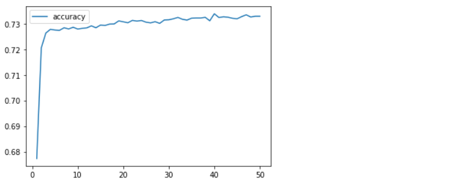

# Deep Learning Homework: Charity Funding Predictor

### Overview

The purpose of this exercise was to create and configure a neural network algorithm model used for predicting whether applicants will be successful (or not) if funded by Alphabet Soup.  The tensor flow module was used to create, train and score the model; also, this is a classification type of problem.    

The historical csv file (charity_data.csv) containing 34k organizations which have previously received funding from Alphabet Soup, was used for compiling the neural network model.   

### Results

- #### Data Processing

  - The primary target in this model is to predict if the applicants will be successful if funded by Alphabet Soup.   As such, the target column is "IS_SUCCESSFUL", as it contains the "1" or "0" metadata we wish to predict.   
  - The features in this model are essentially all of the other columns with the exception of "IS_SUCCESSFUL", "EIN" and "NAME"
  - The "EIN" and "NAME" columns in the charity_data.csv file were considered as irrelevant and are neither targets or features.  Consequently,  both were removed from the neural network model configuration.     

- #### Compiling, Training, and Evaluating the Model

  - The original attempt at running the model uses two hidden layers using the "relu" activation function.  The hidden layers have 10 neurons  each, and the  output layer is sigmoid.   An accuracy score of ~72.8% was achieved which is below the higher than 75% accuracy target.  

  

  

  

  -  My first attempt at using additional model optimization to achieve a greater than 75% accuracy score.  
     - The following modifications were made:  Removed the feature columns "INCOME_AMT" and "SPECIAL CONSIDERATIONS".  The activation functions for both hidden layers were changed from  "relu" to "tanh", and the neurons for both hidden layers were increased from 10 to 20.    An accuracy score of  72.6% was achieved which is below the higher than 75% accuracy target.  

  

  

  

  -  My second attempt at using additional model optimization to achieve a greater than 75% accuracy score.  
     - The following modifications were made for the second attempt:  I added back one column "INCOME_AMT" (note: "SPECIAL CONSIDERATIONS" is still removed).  I changed the activation function back from "tanh" to "relu" and added one more hidden layer (three hidden layers total).   The neurons for the three hidden layers were also increased from 20 to 80.  An accuracy score of 73% was achieved which is slightly above my previous two attempts; however, lower that 75%.  

  

  

  

  - My third attempt at using additional model optimization to achieve a greater than 75% accuracy score.  
    - The following modifications were made for the third attempt:  No columns were dropped and the activation function remains at "relu".   One more hidden layer was added (now the model has four hidden layers total).   The neurons for the four hidden layers were also increased from 80 to 700.   The number of epochs was increased from 50 to 80.   An accuracy score of 73% was achieved which  was the same as my second attempt; however, lower that 75%.  

  

  

  

  #### Summary

  - My highest level of accuracy achieved for this model was 73% for the second and third attempts at optimization.  As additional hidden layers were added, and the number of neurons were increased, the model tended to show very modest improvements.   However, these modifications did not seem to bring the model to the desired 75% plus range.  
  - One recommendation would be to keep the Epoch's below 100 maybe in the 50-75 range.  In my experience with this model, once the model epoch's go beyond 80 to 100 or more, the model tends to lose it's accuracy the batch scores decline.  
  - I observed when the epochs were increased from 80 to 700,  significant processing time was required to complete this attempt at optimization.    

